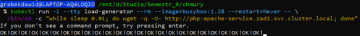
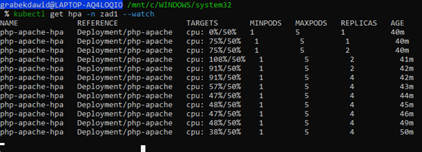

# Sprawozdanie 1

#### Dawid Grabek

_Początkowo zrobiłem plik word i postarałem się przekleić zadania do pliku README, jednak nie ma tu wszystkich screenów, głównie znajdują się tutaj rozwiązanie na zadanie 4, z potwierdzeniem wykonania zadania i uzasadnieniem oraz część nieobowiązkowa, której w pliku word nie ma_

**W razie jakichkolwiek wątpliwości polecam spojrzeć na plik rozwiazanie.pdf**

## Wstęp

_Całość zadania ma być zrealizowana w przestrzeni nazw (namespace) o nazwie zad1. Na
wstępie należy utworzyć manifest (plik yaml) deklarujący przestrzeń nazw zad1. Następnie
uruchomić ten obiekt (tą przestrzeń nazw). Następnie należy utworzyć zestaw plików
manifestów (plików yaml) opisujących obiekty środowiska Kubernetes zgodnie z poniższymi
założeniami:_

```bash
# Tworzenie przestrzeni nazw zad1 do sprawozdania

/d/studia/Semestr_9/chmury
$ cat zad1.yaml
apiVersion: v1
kind: Namespace
metadata:
  name: zad1

/d/studia/Semestr_9/chmury
$ kubectl apply -f zad1.yaml
namespace/zad1 created
```

## Zadanie 4

_Należy utworzyć plik yaml definiujący obiekt HorizontalPodAutoscaler, który pozwoli na
utoskalowanie wdrożenia (Deployment) php_ - _apache z zastosowaniem następujących_
minReplicas: 1
maxReplicas: ???????
targetCPUUtilizationPercentage: 50
_Wartość maxReplicas należy określić samodzielnie, tak by nie przekroczyć parametrów quoty
dla przestrzeni nazw zad5. W sprawozdaniu należy UZASADNIĆ PRZYJĘTY DOBÓR WARTOŚCI._

### Uzasadnienie:

W zadaniu 4 ustaliliłem wartość maxReplicas na 5. Uzasadnienie wynika z ograniczeń
nałożonych przez Resource Quota w przestrzeni nazw zad1, które definiują

- Maksymalna liczba podów: **10**
- Dostępne zasoby CPU: **2000m (2 CPU)**
- Dostępna ilość pamięci RAM: **1.5Gi**

**Obliczenia:**

1. Każdy pod w Deployment ma przypisane:

- CPU
  - limits.cpu = 250m
  - requests.cpu = 150m
- RAM:
  - limits.memory = 250Mi
  - requests.memory = 150Mi.

2. Zasoby wymagane dla 1 poda:

- CPU = 250m
- RAM = 250Mi

3. Maksymalna liczba podów ograniczona zasobami:

- CPU: 2000m / 250m=8
- RAM: 1536Mi / 250Mi~=6

4. Najmniejszy wynik (CPU vs RAM) decyduje: maksymalnie **6 podów**.
5. Biorąc pod uwagę, że w namespace może znajdować się również pod worker, który zajmuje:

- CPU: 200m
- RAM: 200Mi

6. Ograniczenia zasobów dla pozostałych podów:

- CPU: 2000m−200m=1800m
- RAM: 1536Mi−200Mi=1336Mi

7. Po podzieleniu zasobów na pod:

- CPU: 1800m / 250m=7.
- RAM: 1336Mi / 250Mi=5.

Finalna liczba replik: **5** (dla zachowania limitów RAM).

## Zadanie 5

_Udokumentowane w pliku pdf, ale każde utworzenie obiektu bazowało na składni:_

```bash
$ kubectl apply -f <name>.yaml
```

## Zadanie 6

_Ponownie, bazując na przykładach z instrukcji do lab5 i/lub linku podanego w punkcie 3, należy
uruchomić aplikację generującą obciążenie dla aplikacji php_ - _apache i tym samym inicjalizujące
proces autoskalowania wdrożenia tej aplikacji. Za pomocą samodzielnie dobranych poleceń i
wyniku ich działania proszę potwierdzić dobór parametrów z punktu 4._

Wykres obciążenia CPU


Weryfikacja autoskalowania


Zgodnie z wynikami, HorizontalPodAutoscaler (HPA) działa poprawnie. Oto, co się dzieje:

**Obciążenie CPU** : Widać, że CPU w podach przekracza próg 50%, co skutkuje skalowaniem
aplikacji.

Początkowo liczba replik to 1.

Gdy obciążenie CPU wzrosło do 75%, HPA zwiększyło liczbę replik do 2, a finalnie do 4.

**Skalowanie** : HPA poprawnie reaguje na wzrost obciążenia CPU i skaluje liczbę podów, nie
przekraczając ustawionego limitu maxReplicas (5).

**Podsumowanie**

- HPA działa poprawnie, a liczba replik dynamicznie rośnie w odpowiedzi na obciążenie CPU.
- Wszystko jest skonfigurowane zgodnie z oczekiwaniami, a mechanizm autoskalowania działa efektywnie.

# Część nieobowiązkowa

## Zadanie nr. 1

_Czy możliwe jest dokonanie aktualizacji aplikacji (np. wersji obrazu kontenera) gdy aplikacja jest pod kontrolą autoskalera HPA ? Proszę do odpowiedzi (TAK lub NIE) dodać link do fragmentu dokumentacji, w którym jest rozstrzygnięta ta kwestia._

**TAK**

Aktualizacja Deploymentu jest możliwa nawet wtedy, gdy jest on pod kontrolą HPA. Kubernetes zarządza replikami niezależnie podczas procesu aktualizacji. HPA nie przeszkadza w przeprowadzaniu strategii aktualizacji, takich jak `RollingUpdate`.

> A Deployment’s rollout is triggered if and only if the Deployment’s Pod template (that is, .spec.template) is changed, for example if you update the labels or container images of the template. Deployments support updating their Pods in a rolling update fashion by default.

Źródło: [Kubernetes Documentation - Rolling Updates](https://kubernetes.io/docs/concepts/workloads/controllers/deployment/#rolling-update-deployment)

## Zadanie nr. 2

_Jeśli odpowiedź na poprzednie pytanie jest pozytywna to proszę podać przykładowe parametry strategii rollingUpdate, które zagwarantują, że:_

- _a) Podczas aktualizacji zawsze będa aktywne 2 pod-y realizujące działanie przykładowej aplikacji oraz_
- _b) Nie zostaną przekroczone parametry wcześniej zdefiniowanej quoty dla przestrzeni zad1._
- _c) Jeśli należy skorelować (zmienić) ustawienia autoskalera HPA z części obowiązkowej w związku z zaplanowaną strategią aktualizacji to należy również przedstawić te zmiany._

### Przykładowe parametry strategii `rollingUpdate`:

```yaml
spec:
  strategy:
    type: RollingUpdate
    rollingUpdate:
      maxUnavailable: 0
      maxSurge: 1
```

### Wyjaśnienie parametrów:

- maxUnavailable: 0
  - Gwarantuje, że podczas aktualizacji zawsze będą dostępne wszystkie istniejące pody. Dzięki temu aplikacja działa bez przestojów.
- maxSurge: 1
  - Pozwala na uruchomienie maksymalnie jednego dodatkowego poda w czasie aktualizacji. Dzięki temu liczba aktywnych podów nie przekracza wcześniej zdefiniowanych zasobów w ResourceQuota.

### Związek z ResourceQuota:

Przestrzeń zad1 ma ograniczenie ResourceQuota, które pozwala na maksymalnie 10 podów, 2 CPU (2000m) oraz 1.5Gi pamięci.

- Obciążenie CPU i RAM jednego poda:
  - CPU: 250m
  - RAM: 250Mi

**Obliczenia:**

- Dodatkowy pod podczas aktualizacji (maxSurge: 1) wymaga 250m CPU i 250Mi RAM.
- Suma aktywnych podów (2+1) wynosi 3 podczas aktualizacji, co daje:
  - CPU: 3 \* 250m = 750m (mieści się w limicie 2000m).
  - RAM: 3 \* 250Mi = 750Mi (mieści się w limicie 1.5Gi).

**Parametry są więc zgodne z ograniczeniami ResourceQuota.**
